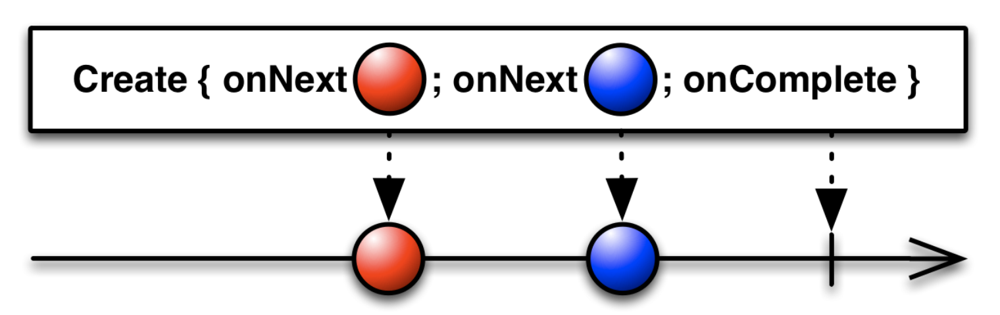

# Photos

> RxSwift를 사용하여 사진을 검색하는 iOS 앱


## 인덱스

- [RxSwift](#rxswift)
  - [Observable](#observable)
  - [Operator](#operator)
  - [RxCocoa Traits](#rxcocoa-traits)
  - [메모리 관리](#메모리-관리)
- [구현](#구현)
  - [검색](#검색)
  - [페이징](#페이징)
  - [상세](#상세)
- [트러블슈팅](#트러블슈팅)
  - [이미지 캐싱](#이미지-캐싱)

## RxSwift

RxSwift는 ReactiveX의 Swift 전용 라이브러리로, `Observable` 시퀀스와 오퍼레이터를 사용해 비동기 작업을 쉽게 구성하고 변환할 수 있도록 한다. RxSwift를 사용하면 코드를 선언형으로 작성할 수 있어 순서 파악이 용이하고, 기존의 `Delegate` 채택 방식과 달리 어떤 UI와 바인딩되는지 명확하게 표현이 가능하다.

### Observable

모든 `Observable`은 시퀀스이며, Swift 시퀀스와의 차이는 비동기적으로 요소를 수신할 수 있다는 점이다. `Observable`은 0개 이상의 요소를 가질 수 있고, `completed` 또는 `error` 이벤트를 방출하면 모든 내부 리소스가 해제된다. `Observable`이 어떤 스레드에서 요소를 생성하는지는 중요하지 않지만, 하나의 요소를 생성해 옵저버에게 보내면 `observer.on` 메서드가 실행을 완료할 때까지 다음 요소를 보낼 수 없다. 또한 `next` 이벤트가 완료되지 않은 경우 `completed` 또는 `error` 이벤트를 방출할 수 없다.

옵저버는 `Observable`을 구독하고, `Observable`이 이벤트를 방출하면 옵저버가 반응한다. 이는 비동기 작업을 가능하게 하는데, `Observable`이 이벤트를 방출할 때까지 기다릴 필요 없이 방출 시점을 감시하는 이벤트 핸들러를 옵저버 안에 두고 해당 핸들러를 통해 알림을 받으면 되기 때문이다.

아래와 같이 `Observable`을 구독하는 경우, 옵저버는 어떻게 생성될까?

```swift
observable.subscribe(onNext: {
    // ...
})
```

`subscribe(onNext:onError:onCompleted:onDisposed:)` 메서드의 구현부를 살펴보면 내부에서 자체적으로 옵저버를 생성하는 것을 알 수 있다. 옵저버 생성 시 `(Event<Element>) -> Void` 타입의 이벤트 핸들러를 전달하는데, 이 핸들러는 이벤트에 따라 해당하는 클로저를 호출한다. 결과적으로 `subscribe(_:)` 메서드로 옵저버가 `Observable`을 구독하도록 하고 `Disposable`을 리턴한다.

```swift
public func subscribe(onNext: ((Element) -> Void)? = nil, onError: ((Swift.Error) -> Void)? = nil, onCompleted: (() -> Void)? = nil, onDisposed: (() -> Void)? = nil) -> Disposable {
    // ...

    let observer = AnonymousObserver<Element> { event in
        // ...

        switch event {
        case .next(let value):
            onNext?(value)
        case .error(let error):
            if let onError = onError {
                onError(error)
            } else {
                Hooks.defaultErrorHandler(callStack, error)
            }
            disposable.dispose()
        case .completed:
            onCompleted?()
            disposable.dispose()
        }
    }
    
    return Disposables.create(self.asObservable().subscribe(observer), disposable)
}
```

### Operator

오퍼레이터는 `Observable`의 생성, 변환, 필터링, 결합 등 `Observable` 조작과 관련한 기능을 제공한다. 또한 오퍼레이터는 `Observable`을 리턴하는데, 이 방식은 오퍼레이터를 연달아 호출할 수 있는 오퍼레이터 체인을 제공한다. 오퍼레이터 체인에서 각각의 오퍼레이터는 이전 오퍼레이터가 리턴한 `Observable`을 변경하므로 호출 순서에 영향을 받는다. 오퍼레이터는 선언형으로 작성할 수 있어 일반적인 비동기 시스템이 가진 중첩 콜백을 제거해 가독성에 좋다.

한 가지 예시로, 직접적인 코드 구현을 통해 `Observable`을 생성하는 `create` 오퍼레이터의 다이어그램 및 코드는 아래와 같다. `AnyObserver<Element>` 타입의 옵저버를 인자로 받는 클로저를 `create`에 전달하고, 해당 클로저에서는 `on(_:)` 메서드를 통해 옵저버에게 이벤트를 알린다. `completed` 또는 `error` 이벤트는 한 번만 방출해야 하며, 방출 시 시퀀스가 종료된다.

<p align="center"></p>

> 출처: [ReactiveX](https://reactivex.io/documentation/operators/create.html)

```swift
Observable.create { observer in
    observer.on(.next("🔴"))
    observer.on(.next("🔵"))
    observer.on(.completed)
    return Disposables.create()
}
```

### RxCocoa Traits

특성(trait)은 단일 읽기 전용 `Observable` 프로퍼티를 갖는 wrapper 구조체이다. RxCocoa의 특성은 UI를 직관적으로 사용하기 위한 기능을 제공한다. 앱은 항상 사용자 입력에 응답해야 하므로 해당 특성은 기본적으로 에러를 발생시키지 않는다.

```swift
// UISearchBar - Reactive<UISearchBar> - ControlProperty<String?> - ControlProperty<String>
searchBar.rx.text.orEmpty
    .debounce(.milliseconds(300), scheduler: MainScheduler.instance)
    .distinctUntilChanged()
    .bind(to: viewModel.searchTerm)
    .disposed(by: disposeBag)

// UITableView - Reactive<UITableView> - ControlEvent<PhotoViewModel> - Driver<PhotoViewModel>
photoListTableView.rx.modelSelected(PhotoViewModel.self).asDriver()
    .drive(onNext: {
        self.showDetail(with: $0)
    })
    .disposed(by: disposeBag)
```

- `ControlProperty`: UI 요소의 프로퍼티를 나타낸다. 초기값과 사용자가 입력한 값은 반영되고, 프로그래밍 방식으로 변경한 값은 반영되지 않는다. 메인 스케줄러에서 구독(`subscribe(on:)`)된다.
- `ControlEvent`: UI 요소의 이벤트를 나타낸다. 메인 스케줄러에서 구독(`subscribe(on:)`)된다.
- `Driver`: UI 요소에 바인딩하기 위해 사용한다. 메인 스케줄러에서 관찰(`observe(on:)`)되고, 이벤트를 공유(`share(replay:scope:)`)한다.

### 메모리 관리

클로저는 생성 시 내부에서 접근하는 외부 변수의 값을 캡처한다. 변수가 값 타입인 경우 단순히 값이 복사되지만, 레퍼런스 타입인 경우에는 레퍼런스 카운트가 증가한다. `Observable` 구독 시 전달하는 핸들러에서 `self`를 캡처하면 레퍼런스 카운트가 증가하게 되는데, 이를 처리할 수 있는 몇 가지 방법이 있다.

1. `weak self`로 약하게 참조해 레퍼런스 카운트를 증가시키지 않는다.
2. `completed` 이벤트 방출로 시퀀스를 종료해 레퍼런스 카운트를 감소시킨다.
3. `dispose()` 메서드로 각각의 구독을 해지하거나, `DisposeBag` 인스턴스를 할당 해제하고 포함된 모든 구독을 해지해 레퍼런스 카운트를 감소시킨다.

앱에서는 `DisposeBag` 인스턴스를 할당 해제하는 방식을 취하고 있다. 뷰가 로드되면 시퀀스를 구독하고, `didMove(toParent:)` 메서드를 통해 뷰 컨트롤러가 해제되는 시점에 `DisposeBag` 인스턴스를 해제하고 레퍼런스 카운트를 감소시킨다.

```swift
final class SearchViewController: UIViewController {
    private var disposeBag = DisposeBag()
    
    override func viewDidLoad() {
        super.viewDidLoad()
        bindInput()
    }
    
    override func didMove(toParent parent: UIViewController?) {
        super.didMove(toParent: parent)
        if parent == nil { disposeBag = DisposeBag() }
    }
    
    private func bindInput() {
        photoListTableView.rx.modelSelected(PhotoViewModel.self)
            .asDriver()
            .drive(onNext: {
                self.showDetail(with: $0)
            })
            .disposed(by: disposeBag)
    }
    
    private func showDetail(with viewModel: PhotoViewModel) {
        // ...
    }
}
```

## 구현

### 검색

[SearchViewController](https://github.com/meregrey/photos-rx/blob/main/Photos/Photos/Search/SearchViewController.swift)의 서치 바에 검색어를 입력하면 `debounce` 오퍼레이터를 통해 검색어 입력이 끝난 시점에 이벤트가 방출된다. `debounce`는 특정 시간마다 그 시점에 존재하는 요소 하나를 시퀀스로부터 방출하는 오퍼레이터로, 새로운 요소가 생성되면 경과한 시간이 리셋되는 개념이다. 이렇게 요소가 방출되면 `bind(to:)` 메서드를 통해 새 구독을 만들고, `BehaviorRelay<String>` 타입의 `viewModel.searchTerm`에 요소를 전달한다. `BehaviorRelay`는 `BehaviorSubject`의 wrapper 클래스로, `BehaviorSubject`와 달리 `completed` 또는 `error` 이벤트를 방출하지 않아 종료되지 않는 시퀀스이다. UI의 인풋을 다루는 시퀀스는 종료되어서는 안 되므로 `BehaviorRelay`에 바인딩한다.

아웃풋 바인딩에서는 `BehaviorRelay<[PhotoViewModel]>` 타입의 `viewModel.photos`를 `asDriver()` 메서드를 통해 `Driver`로 변환한다. `Driver`는 메인 스케줄러에서 관찰되고 에러를 내지 않으므로 UI 바인딩에 적합하다. 다음으로 `drive(_:curriedArgument:)` 메서드를 통해 시퀀스 구독 시, 두 가지 인자를 전달한다. 첫 번째 인자는 시퀀스로부터 바인딩하는 `Self -> R1 -> R2` 타입의 클로저이고, 두 번째는 클로저에 전달할 `R1` 타입의 인자이다. 첫 번째 인자로 `items(cellIdentifier:cellType:)` 메서드의 리턴값을 사용하는데, 해당 리턴 타입은 `(Source) -> (@escaping (Int, Sequence.Element, Cell) -> Void) -> Disposable`이다. 결과적으로 `Source`에 대해 `Observable<[PhotoViewModel]>` 시퀀스가 전달되고 `@escaping (Int, Sequence.Element, Cell) -> Void` 클로저로 셀을 구성하는 데이터 소스가 생성되어 테이블 뷰와 바인딩된다.

```swift
final class SearchViewController: UIViewController {
    private func bindInput() {
        searchController.searchBar.rx.text.orEmpty
            .debounce(.milliseconds(300), scheduler: MainScheduler.instance)
            .distinctUntilChanged()
            .bind(to: viewModel.searchTerm)
            .disposed(by: disposeBag)
    }
    
    private func bindOutput() {
        viewModel.photos
            .asDriver()
            .drive(photoListTableView.rx.items(cellIdentifier: PhotoListTableViewCell.identifier, cellType: PhotoListTableViewCell.self)) { _, viewModel, cell in
                cell.configure(with: viewModel)
            }
            .disposed(by: disposeBag)
    }
}
```

[SearchViewModel](https://github.com/meregrey/photos-rx/blob/main/Photos/Photos/Search/SearchViewModel.swift)은 뷰의 인풋에 따라 네트워킹을 실행하고 결과를 변환해 이벤트를 방출하도록 한다. 해당 과정은 이니셜라이저에서 정의되는데, 시퀀스에 오퍼레이터를 사용하고 바인딩하는 방식이다. 먼저   `distinctUntilChanged`를 사용해 요소가 변경된 경우에만 방출되도록 하고, `flatMap`으로 검색 및 변환한다. `flatMap`은 각각의 요소들을 시퀀스로 변환한 후 여러 개의 시퀀스를 하나로 병합하는 오퍼레이터로, 인자로 전달한 메서드가 `Observable`을 리턴하기에 사용한다. 만약 `flatMap` 대신 `map`을 사용하면 `Observable<Observable<[Photo]>>`와 같은 형태가 된다. `searchPhotos(for:)` 및 `transform(_:)` 메서드가 `Observable`을 리턴하는 이유는 비동기로 작업을 수행하기 때문이다. 이렇게 `Observable<[PhotoViewModel]>` 타입으로 변환된 시퀀스는 `BehaviorRelay<[PhotoViewModel]>` 타입의 `photos`에 바인딩되고, 해당 시퀀스가 이벤트를 방출하면 뷰의 UI가 업데이트된다.

```swift
final class SearchViewModel {
    let searchTerm = BehaviorRelay<String>(value: "")
    let photos = BehaviorRelay<[PhotoViewModel]>(value: [])
    
    init() {
        searchTerm
            .distinctUntilChanged()
            .flatMap(searchPhotos)
            .flatMap(transform)
            .bind(to: photos)
            .disposed(by: disposeBag)
    }
    
    private func searchPhotos(for searchTerm: String) -> Observable<[Photo]> {
        // ...
    }
    
    private func transform(_ photos: [Photo]) -> Observable<[PhotoViewModel]> {
        // ...
    }
}
```

### 페이징

검색어 입력 후 지정된 개수만큼 데이터를 가져와 화면에 표시하고, 다음 데이터를 표시해야 하는 시점에 다시 서버에 요청한다. 다음 데이터가 필요한 시점은 스크롤을 통해 목록의 하단에 도달하기 직전으로, `photoListTableView.rx.contentOffset`에 접근해 `ControlProperty<CGPoint>` 시퀀스를 활용한다. 구현 방법으로는 `map`을 통해 `Observable<Bool>`로 변환한 후 `BehaviorRelay<Bool>` 타입의 `viewModel.shouldLoadMorePhotos`에 바인딩한다. 이때 `Bool` 값은 하단 도달 여부로, [UIScrollView](https://github.com/meregrey/photos-rx/blob/main/Photos/Photos/Common/Extensions/UIScrollView.swift) 익스텐션을 통해 정의한 `isNearBottom(offset:)` 메서드를 사용한다.

```swift
final class SearchViewController: UIViewController {
    private func bindInput() {
        photoListTableView.rx.contentOffset
            .map(isNearBottom)
            .bind(to: viewModel.shouldLoadMorePhotos)
            .disposed(by: disposeBag)
    }
    
    private func isNearBottom(_: CGPoint) -> Bool {
        return photoListTableView.isNearBottom()
    }
}
```

`shouldLoadMorePhotos`를 바인딩하기 위해서는 먼저 `filter`를 사용해 요소가 `true`인 경우에만 방출되도록 하고 무분별한 서버 요청을 방지한다. 조건을 만족하는 경우 페이지에 해당하는 데이터를 가져와 변환하고, 기존 데이터에 새로운 데이터를 더한 결과를 방출한다.

```swift
final class SearchViewModel {
    let shouldLoadMorePhotos = BehaviorRelay<Bool>(value: false)
    let photos = BehaviorRelay<[PhotoViewModel]>(value: [])
    
    init() {
        shouldLoadMorePhotos
            .distinctUntilChanged()
            .filter { $0 }
            .flatMap(loadMorePhotos)
            .flatMap(transform)
            .bind(to: photos)
            .disposed(by: disposeBag)
    }
    
    private func loadMorePhotos(_: Bool) -> Observable<[Photo]> {
        // ...
    }
    
    private func transform(_ photos: [Photo]) -> Observable<[PhotoViewModel]> {
        // ...
    }
}
```

### 상세

목록에서 사진 선택 시 상세 화면을 표시한다. `modelSelected(_:)` 메서드는 `tableView(_:didSelectRowAt:)` 델리게이트 메서드의 wrapper 메서드로, 인덱스에 해당하는 모델을 요소로 갖는 `ControlEvent<T>`를 리턴한다. 메인 스레드에서 동작하도록 `Driver`로 변환한 후, [PhotoViewModel](https://github.com/meregrey/photos-rx/blob/main/Photos/Photos/Common/ViewModels/PhotoViewModel.swift) 타입의 요소를 사용해 내비게이션을 수행한다.

```swift
final class SearchViewController: UIViewController {
    private func bindInput() {
        photoListTableView.rx.modelSelected(PhotoViewModel.self)
            .asDriver()
            .drive(onNext: {
                self.showDetail(with: $0)
            })
            .disposed(by: disposeBag)
    }
    
    private func showDetail(with viewModel: PhotoViewModel) {
        // ...
        detailViewController.viewModel = viewModel
        navigationController?.pushViewController(detailViewController, animated: true)
    }
}
```

## 트러블슈팅

### 이미지 캐싱

생성 비용이 큰 이미지를 메모리에 캐싱하도록 구현했는데, 메모리가 부족해진 경우 이미지가 캐시에서 삭제되어 표시되지 않는 문제가 발생했다. 사진 목록은 페이징을 통해 지정된 개수의 데이터를 가져오고 이미지 로드가 전부 끝난 시점에 테이블 뷰에 행을 추가하는데, 이는 이미지 크기에 따라 행 높이를 계산하기 위해서다. 따라서 이미지가 캐시에 존재하지 않는 경우 비동기 로드를 하게 되면 스크롤이 버벅이고 이미지 크기가 정상적으로 표시되지 않는다.

결과적으로 디스크 캐싱을 활용해 해결했다. [DiskCache](https://github.com/meregrey/photos-rx/blob/main/Photos/Photos/Common/Utils/DiskCache.swift)는 `FileManager`를 사용해 디렉토리 및 파일을 처리하는 클래스로, 번들 식별자를 이름으로 하는 기본 디렉토리를 `default` 프로퍼티로 제공한다. `DiskCache` 생성 시 `FileManager` 인스턴스와 디렉토리 이름으로 사용할 문자열을 전달 받는데, Caches 디렉토리 경로에 해당 이름을 추가해 경로를 지정한다. Caches 디렉토리를 사용하는 이유는 파일이 사용자에게 노출되지 않고 iCloud에 백업되지 않기 때문이다.

```swift
final class DiskCache {
    static let `default` = DiskCache(fileManager: FileManager.default, directoryName: Bundle.main.bundleIdentifier ?? "")
    
    private let fileManager: FileManager
    private let directoryName: String
    
    private var directoryPath: String { fileManager.urls(for: .cachesDirectory, in: .userDomainMask).first?.appendingPathComponent(directoryName).relativePath ?? "" }
    
    init(fileManager: FileManager, directoryName: String) {
        // ...
    }
}
```

[ImageLoader](https://github.com/meregrey/photos-rx/blob/main/Photos/Photos/Common/Networking/ImageLoader.swift)는 이미지 로드 시 디스크 및 메모리 캐싱을 사용하는데, URL에 해당하는 이미지가 메모리와 디스크 모두에 없는 경우에만 로드를 실행한다. 네트워킹을 통해 이미지를 가져오면 디스크 및 메모리에 저장하며, 반환 시에는 메모리 캐시에서 먼저 검색하고 존재하지 않는 경우 디스크 캐시의 이미지를 메모리 캐시에 저장한 후 반환한다. `loadImages(from:)` 메서드 내부에서 `flatMap(loadImage)`와 같이 동작하는 이유는 URL에 대한 이미지가 동시적으로 로드되어 각각의 `Observable<UIImage>`로 반환되기 때문에 하나의 시퀀스로 병합하기 위해서다.

```swift
final class ImageLoader: ImageLoadable {
    private let diskCache = DiskCache.default
    private let memoryCache = ImageCache()
    private let backgroundScheduler = ConcurrentDispatchQueueScheduler(qos: .default)
    
    func loadImages(from urls: [URL]) -> Observable<UIImage> {
        return Observable.from(urls)
            .filter(notExists)
            .flatMap(loadImage)
    }
    
    private func notExists(for url: URL) -> Bool {
        return memoryCache.image(for: url) == nil && diskCache.exists(named: url.imageName) == false
    }
    
    private func loadImage(from url: URL) -> Observable<UIImage> {
        return URLSession.shared.rx.data(request: URLRequest(url: url))
            .map {
                // ...
                self.diskCache.store(data, named: url.imageName)
                self.memoryCache.store(image, for: url)
                return image
            }
            .subscribe(on: backgroundScheduler)
    }
}
```

[SearchViewModel](https://github.com/meregrey/photos-rx/blob/main/Photos/Photos/Search/SearchViewModel.swift)은 사진을 검색하고 변환하는 데 `ImageLoader`를 사용한다. `searchPhotos(for:)` 메서드에서는 우선 캐시를 초기화한 후 API를 호출하는데, 해당 메서드가 실행되는 시점이 검색어가 새로 입력된 경우이므로 기존의 캐시를 전부 삭제한다. 반면 `loadMorePhotos(_:)` 메서드는 동일한 검색어에 대한 이미지를 추가로 로드하는 동작이기에 캐시를 초기화하지 않는다. `transform(_:)` 메서드에서는 URL에 해당하는 이미지를 로드한다. 시퀀스 구독 시 `onCompleted` 핸들러를 전달하는 것을 볼 수 있는데, 모든 이미지의 로드가 완료된 시점에 아웃풋 시퀀스에 바인딩하기 위해서다.

```swift
final class SearchViewModel {
    private func searchPhotos(for searchTerm: String) -> Observable<[Photo]> {
        imageLoader.clearCache()
        page = 1
        return api.searchPhotos(query: searchTerm, page: page)
    }
    
    private func loadMorePhotos(_: Bool) -> Observable<[Photo]> {
        page += 1
        return api.searchPhotos(query: searchTerm.value, page: page)
    }
    
    private func transform(_ photos: [Photo]) -> Observable<[PhotoViewModel]> {
        let urls = photos.compactMap { $0.url }
        
        _ = imageLoader.loadImages(from: urls)
            .subscribe(onCompleted: {
                if photos.count > 0 {
                    // ...
                } else {
                    // ...
                }
            })
        
        return photoViewModels.asObservable()
    }
}
```

마지막으로 [AppDelegate](https://github.com/meregrey/photos-rx/blob/main/Photos/Photos/Common/App/AppDelegate.swift)는 앱 런치 시 디스크 캐시 디렉토리 존재 여부에 따라 디렉토리를 생성하고, 앱 종료 시 디스크 캐시를 초기화한다.

```swift
final class AppDelegate: UIResponder, UIApplicationDelegate {
    private let diskCache = DiskCache.default
    
    func application(_ application: UIApplication, didFinishLaunchingWithOptions launchOptions: [UIApplication.LaunchOptionsKey: Any]?) -> Bool {
        diskCache.createDirectoryIfNeeded()
        return true
    }
    
    func applicationWillTerminate(_ application: UIApplication) {
        diskCache.clear()
    }
}
```
